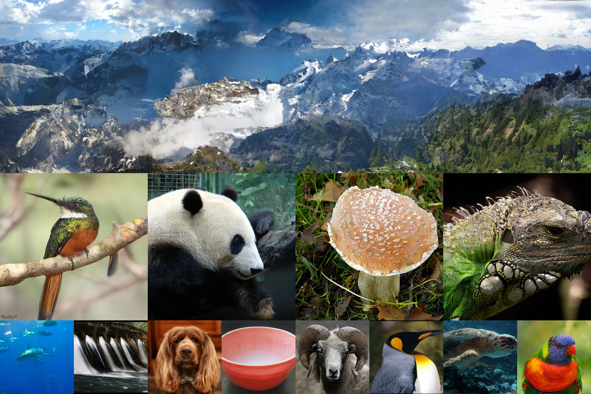

# LEGO-Diffusion
[](https://paperswithcode.com/sota/image-generation-on-celeba-64x64?p=learning-stackable-and-skippable-lego-bricks) [](https://paperswithcode.com/sota/image-generation-on-imagenet-64x64?p=learning-stackable-and-skippable-lego-bricks) [](https://paperswithcode.com/sota/image-generation-on-imagenet-256x256?p=learning-stackable-and-skippable-lego-bricks) 
 Pytorch implementation of LEGO-Diffusion: Learning stackable and skippable LEGO bricks for efficient, reconfigurable, and variable-resolution diffusion modeling.

### [Paper](https://openreview.net/pdf?id=qmXedvwrT1) | [ArXiv](https://arxiv.org/abs/2310.06389) | [Project Page](https://huangjiezheng.com/LEGODiffusion/)


**Learning stackable and skippable LEGO bricks for efficient, reconfigurable, and variable-resolution diffusion modeling**

*Huangjie Zheng, Zhendong Wang, Jianbo Yuan, Guanghan Ning, Pengcheng He, Quanzeng You, Hongxia Yang, Mingyuan Zhou*




## 1.Requirements:
The code has been tested with CUDA 11.8/CuDNN 8, PyTorch 2.0. We provide [environment.yml](./environment.yml) reference of library dependencies. For easy start, we recommend to first follow the environment setup in [EDM](https://github.com/NVlabs/edm) repo and install the following dependency on top of it:

```
- timm
- diffusers
- accelerate
```

## 2. Dataset preparation
Datasets are stored in the same format as in [StyleGAN](https://github.com/NVlabs/stylegan3) and [EDM](https://github.com/NVlabs/edm): uncompressed ZIP archives containing uncompressed PNG files and a metadata file `dataset.json` for labels. Custom datasets can be created from a folder containing images; see [`python dataset_tool.py --help`](./dataset_tool.py) and the [EDM doc](https://github.com/NVlabs/edm/blob/main/docs/dataset-tool-help.txt) for more information.

We additionally provide a [`latent_dataset_tool.py`](./latent_dataset_tool.py) to leverage SD autoencoder to preprocess images to latent tensors with x8 downsampling ratio. Below we provide an example usage to preprocess ImageNet data to latent:

```
python latent_dataset_tool.py --source path/to/ImageNet_folder --dest path/to/imagenet_latent.zip
        --transform=center-crop --resolution=256x256
```
The command above will first center crop images and rescale to resolution 256x256, then store the downsampled latents into a .zip file containing latent .npy files and the corresponding labels into `dataset.json`. Each latent tensor will have a shape [32, 32, 4] (before processing the RGB image has shape [256, 256, 3]).

## 3. Train LEGO models

You can train LEGO models by running `train.py` with specified options. For example, to train a LEGO-S-PG model on CelebA-64x64 dataset with 8 GPUs:
```
torchrun \
--standalone \
--nproc_per_node 8 \
train.py --data=path/to/celeba/celaba-64x64.zip --outdir=results/lego_diffusion/lego_S_celeba/ \
--arch=lego_S_PG_64 --lr=0.0001 --duration=200 
```

This code contains an auto-resuming function. By setting the `--resume` option point to the experiment folder, it will search for the latest checkpoint to resume; otherwise, you may specify which checkpoint to resume:

```
# auto resume
torchrun --standalone --nproc_per_node 8 \
train.py --data=path/to/celeba/celaba-64x64.zip --outdir=results/lego_diffusion/lego_S_celeba/ \
--arch=lego_S_PG_64 --lr=0.0001 --duration=200 --resume=results/lego_diffusion/lego_S_celeba/

# specify the checkpoint to resume
torchrun --standalone --nproc_per_node 8 \
train.py --data=path/to/celeba/celaba-64x64.zip --outdir=results/lego_diffusion/lego_S_celeba/ \
--arch=lego_S_PG_64 --lr=0.0001 --duration=200 --resume=results/lego_diffusion/lego_S_celeba/xxx-exp/training-state-xxx.pt
```


## 4. Sampling using LEGO models

You may sample images with the trained LEGO models. For example, to generate a small batch of image using a LEGO-U model: 
```
# If directly generate in pixel space
torchrun --standalone --nproc_per_node=8 \
generate.py --seeds=0-63 --outdir=tmp --network=LEGO-L-PG-64.pkl --cfg_scale=4 --steps=256

# If using SD decoder
torchrun --standalone --nproc_per_node=8 \
generate.py --seeds=0-63 --outdir=tmp --network=LEGO-XL-U-256.pkl --cfg_scale=4 --steps=256 --vae=True
```

Alternatively, to generate 50k samples for FID evaluation please make sure `--seeds` refers to a range covering 50k images. In addition, you may tune the sampling hyper-parameters controlling the stochasticity in sampling to achieve a better performance. For example:
```
torchrun --standalone --nproc_per_node=8 \
generate.py --seeds=0-49999 --outdir=tmp --network=LEGO-XL-U-256.pkl --cfg_scale=1.5 --steps=256 --vae=True --S_churn=10 --S_min=0.05 --S_max=10 --S_noise=1.003  --cfg_scale=1.5 --npz=True
```

To skip LEGO bricks in the sampling for faster generation, you may set `--skip_bricks=True` and determine from which step to use lighter model by setting `--skip_ratio=0.4` or other desired value.

Since we use the evaluation kit provided in [ADM](https://github.com/openai/guided-diffusion/tree/main/evaluations). You may set `--npz=True` when sampling, and the output .npz file can be used for evaluation.


Here we provide checkpoints of LEGO-PG, LEGO-PR, and LEGO-U models in our [HuggingFace repo](https://huggingface.co/hjzheng/LEGO-Diffusion/tree/main). Below is the summary of our pretrained models:

| LEGO Model     | Image Resolution | FID-50K | Inception Score | Model Size | 
|---------------|------------------|---------|-----------------|--------|
| [LEGO-L-PG](https://huggingface.co/hjzheng/LEGO-Diffusion/resolve/main/LEGO-L-PG-64.pkl) | 64 x 64          | 2.16    | 78.66          | 0.4B    |
| [LEGO-L-PR](https://huggingface.co/hjzheng/LEGO-Diffusion/resolve/main/LEGO-L-PR-64.pkl) | 64 x 64          | 2.29    | 78.66          | 0.4B    |
| [LEGO-XL-U](https://huggingface.co/hjzheng/LEGO-Diffusion/resolve/main/LEGO-XL-U-256.pkl) | 256 x 256          | 2.59    | 338.08          | 1.2B    |

### BibTex
If you find our work useful or incorporate our findings in your own research, please consider citing our paper:
```
@inproceedings{
zheng2024learning,
title={Learning Stackable and Skippable {LEGO} Bricks for Efficient, Reconfigurable, and Variable-Resolution Diffusion Modeling},
author={Huangjie Zheng and Zhendong Wang and Jianbo Yuan and Guanghan Ning and Pengcheng He and Quanzeng You and Hongxia Yang and Mingyuan Zhou},
booktitle={The Twelfth International Conference on Learning Representations},
year={2024},
url={https://openreview.net/forum?id=qmXedvwrT1}
}
```

### Acknowledgements
We extend our gratitude to the authors of the [EDM](https://github.com/nvlabs/edm) and [DiT](https://github.com/facebookresearch/DiT) paper for open-sourcing their code, which served as the foundational framework for our research. 

H. Zheng, Z. Wang, and M. Zhou acknowledge the support of NSF-IIS 2212418, NIH-R37 CA271186, and the NSF AI Institute for
Foundations of Machine Learning (IFML). 


### Contact
Please feel free to reach me out at `huangjie.zheng@utexas.edu` if you have any questions.